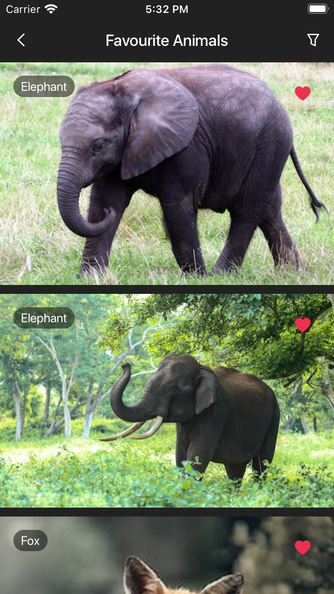

# iOS-AnimalApp-Assignment

This Swift application allows users to browse a list of animals, view their pictures, and add their favorite images to a dedicated collection.

## Requirements

### Screens

The app consists of three main screens:

1. **List of Animals**
   - Displays a list of animals: Elephant, Lion, Fox, Dog, Shark, Turtle, Whale, Penguin.
   - Tapping on any animal navigates to the "Animal Pictures" screen.
   - Includes a "favorites" button to navigate to the "Favorite Pictures" screen.
     
    
   
2. **Animal Pictures**
   - Shows all available pictures of a selected animal.
   - Allows users to like/unlike specific images by tapping the image or a favorite button.
     
    

3. **Favorite Pictures**
   - Displays images that the user has liked.
   - Indicates which animal a particular image belongs to.
   - Enables users to filter images by selecting an animal.
     
    
   
    

### Open API

- Use the [API-Ninjas Animals API](https://api-ninjas.com/api/animals) with the provided API Key: `pfFQJxLiPMYqvY5rZXbYdw==VBjYVanTRFZdEhx9`.
- For images, utilize the [Pexels API](https://www.pexels.com/api/documentation/) with the provided API Key: `F0RsC7L6viQO7bzFmZTKs7hwGWhXlwm5TjAozyXUwkTmB8INisxbwjVg`.


## NOTE:

- Code is available in `dev` branch: https://github.com/mobiosolutions/iOS-AnimalApp-Assignment/tree/dev
- The [API-Ninjas Animals API](https://api-ninjas.com/api/animals) is not used due to its limitation on supporting only the "name" parameter for partial matches.

## Development

- The app must be written in Swift.
- Utilize Core Data for data management.

## Setup

1. Clone the repository:

   ```bash
   git clone https://github.com/your-username/BrandsAreLive-Practical.git
   cd BrandsAreLive-Practical
   ```

2. Install dependencies using [CocoaPods](https://cocoapods.org/):

   ```bash
   pod install
   ```

3. Open the `.xcworkspace` file:

   ```bash
   open BrandsAreLive-Practical.xcworkspace
   ```

4. Add the API keys to the project:
   - In the `Info.plist` file, add the API keys under the keys `ApiNinjasKey` and `PexelsApiKey`.

5. Build and run the app.

## Demo

- Download Screen Recording
  https://github.com/mobiosolutions/iOS-AnimalApp-Assignment/blob/dev/demo/assignment_demo.mp4

## App Icon


### Gitflow Branching Model

#### 1. **Master/Main Branch:**

- The `main` branch will always represent a stable and production-ready version of application.
- Direct commits to `main` are typically avoided.

#### 2. **Testing and Staging Branch:**

 - Before merging into `main` for a release, changes need to be thoroughly tested.
 - A `stage` branch is created from the latest `develop`.
 - This `stage` branch acts as an intermediate step for final testing and staging before production.

   ```bash
   git checkout develop
   git pull origin develop
   git checkout -b stage develop
   ```

 - QA and testing teams can perform comprehensive testing on the `stage` branch.
 - If any issues are found, they can be addressed directly on the `stage` branch.

 - Once the `stage` branch is thoroughly tested and validated, it can be merged into `main` and `develop`.

   ```bash
   git checkout main
   git pull origin main
   git merge --no-ff stage
   git tag -a 1.0.2 -m "Stage Release 1.0.2"
   git checkout develop
   git merge --no-ff stage
   git branch -d stage
   git push origin main
   git push origin develop
   git push --tags
   ```

#### 3. **Develop Branch:**

- The `dev` branch is the main integration branch where all feature branches are merged.
- Feature branches are created off `develop`.

#### 4. **Feature Branches:**

- Feature branches are created for the development of new features.
- Naming convention: `feature/{feature-name}`.
- Feature branches are branched off from `develop`.
- Once a feature is complete, it is merged back into `develop`.

   ```bash
   git checkout develop
   git pull origin develop
   git checkout -b feature/new-feature develop
   # Work on the feature, commit changes
   git checkout develop
   git merge --no-ff feature/new-feature
   git branch -d feature/new-feature
   git push origin develop
   ```

#### 5. **Release Branches:**

- A `release` branch is created when the `stage` branch is deemed stable for release.
- Naming convention: `release/{version-number}`.
- No new features are added to the `release` branch, only bug fixes.
- Once ready, the `release` branch is merged into both `main` and `stage`.

   ```bash
   git checkout stage
   git pull origin stage
   git checkout -b release/1.0.0 stage
   # Perform necessary release activities, bug fixes
   git checkout main
   git merge --no-ff release/1.0.0
   git tag -a 1.0.0 -m "Release 1.0.0"
   git checkout stage
   git merge --no-ff release/1.0.0
   git branch -d release/1.0.0
   git push origin main
   git push origin stage
   git push --tags
   ```

